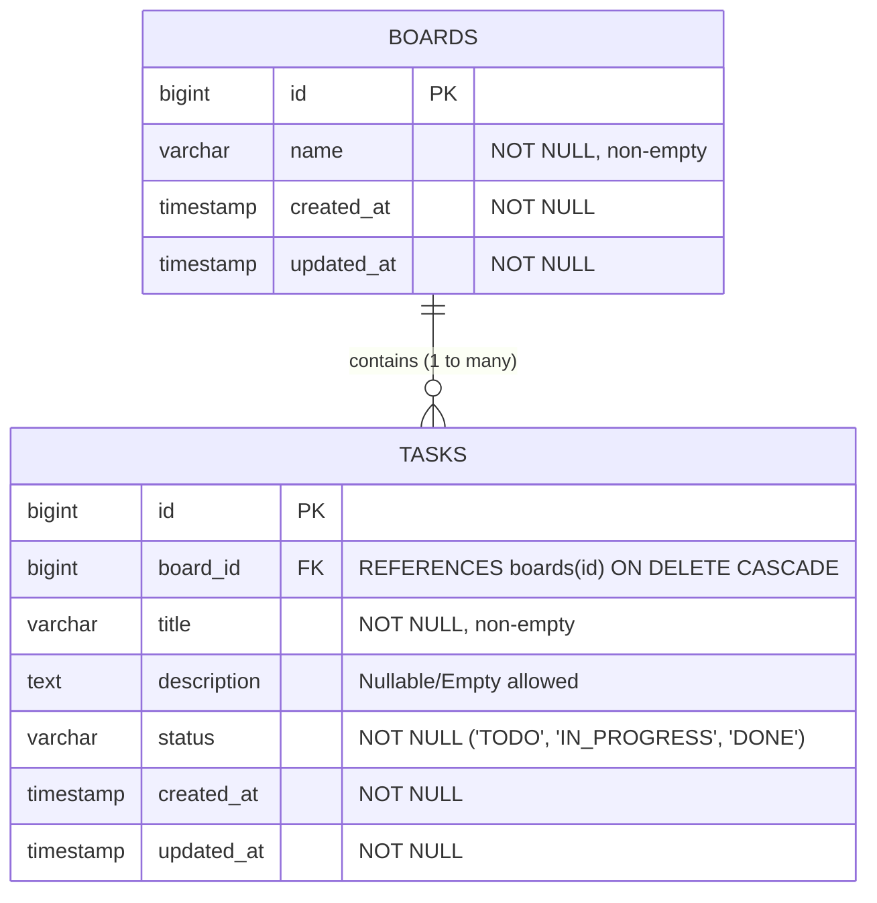

# Database Schema Documentation

This document describes the database design, tables, relationships, constraints, indexes, and architectural decisions for the Mini Task Management application (satisfying requirements **R1** through **R7**).

---

## 1. Schema Overview

The database uses a relational schema with two primary entities:
1. `boards`: Named project containers (e.g., "Q3 Website Refresh", "Onboarding").
2. `tasks`: Actionable items belonging strictly to a parent board.



---

## 2. Table Specifications

### 2.1. `boards` Table (R1)

Represents a board container.

| Column | Data Type | Nullable | Default | Constraints & Keys | Description |
|---|---|---|---|---|---|
| `id` | `BIGINT` | No | Auto-increment | `PRIMARY KEY` | Unique 64-bit board identifier. |
| `name` | `VARCHAR(255)` | No | — | `CHECK (name != '')` | Name of the board (required, non-empty). |
| `created_at` | `TIMESTAMPTZ` / `DATETIME` | No | Current timestamp | — | Timestamp when entity was created. |
| `updated_at` | `TIMESTAMPTZ` / `DATETIME` | No | Current timestamp | — | Timestamp when entity was last updated. |

#### Constraints:
- `PRIMARY KEY (id)`
- `CHECK (name != '')` (`board_name_not_empty`): Enforces at the database level that empty strings cannot be inserted.

---

### 2.2. `tasks` Table (R2, R3, R4)

Represents an individual task within a specific board.

| Column | Data Type | Nullable | Default | Constraints & Keys | Description |
|---|---|---|---|---|---|
| `id` | `BIGINT` | No | Auto-increment | `PRIMARY KEY` | Unique 64-bit task identifier. |
| `board_id` | `BIGINT` | No | — | `FOREIGN KEY` → `boards(id)` | Board reference (`ON DELETE CASCADE`). |
| `title` | `VARCHAR(255)` | No | — | `CHECK (title != '')` | Title of the task (required, non-empty). |
| `description` | `TEXT` | No | `''` | — | Optional detailed description. |
| `status` | `VARCHAR(20)` | No | `'TODO'` | `CHECK (status IN (...))` | Current lifecycle status (`TODO`, `IN_PROGRESS`, `DONE`). |
| `created_at` | `TIMESTAMPTZ` / `DATETIME` | No | Current timestamp | — | Timestamp when entity was created. |
| `updated_at` | `TIMESTAMPTZ` / `DATETIME` | No | Current timestamp | — | Timestamp when entity was last updated. |

#### Foreign Key & Deletion Policy (R3, R4):
- **Constraint**: `FOREIGN KEY (board_id) REFERENCES boards(id) ON DELETE CASCADE`.
- **Enforcement**: Enforced directly by the database engine. Direct SQL inserts referencing a non-existent `board_id` fail with `IntegrityError`.
- **Reasoning for `ON DELETE CASCADE`**: A board acts as an aggregate container. Tasks have no independent domain meaning or lifecycle without their parent board. Cascading deletion cleanly purges tasks at the database level without requiring multi-step application cleanup, preventing orphaned rows.

#### Check Constraints:
1. `task_title_not_empty`: `CHECK (title != '')` — guarantees at the database level that empty titles cannot be saved.
2. `task_status_valid`: `CHECK (status IN ('TODO', 'IN_PROGRESS', 'DONE'))` — restricts status values directly in the database engine to the allowed enum values.

---

## 3. Database Indexes (R5)

Beyond primary key indexes (`boards_pkey` and `tasks_pkey`), the following secondary indexes are explicitly configured on `tasks`:

| Index Name | Table | Columns | Type | Purpose / Justification |
|---|---|---|---|---|
| `tasks_board_id_idx` | `tasks` | `(board_id)` | B-Tree | Accelerates joins and foreign key lookups when querying tasks by board. |
| `idx_tasks_board_status` | `tasks` | `(board_id, status)` | B-Tree (Composite) | Optimizes `GET /api/boards/{boardId}/tasks?status=...` query filtering by both board and status simultaneously. |
| `idx_tasks_board_created` | `tasks` | `(board_id, created_at)` | B-Tree (Composite) | Optimizes default chronological retrieval and sorting of tasks within a board. |

*Note: No secondary index was placed on `boards(name)` because board lookups are done by primary key `id`, and the total number of boards is manageable where full-table scans for listings are negligible.*

---

## 4. Schema Generation & Migrations (R6)

The schema is versioned and applied using **Django Migrations**.

To create the schema from an empty database:
```bash
python manage.py migrate
```

Migration history is tracked in `src/database/migrations/`:
- `0001_initial.py`: Creates `boards` and `tasks` tables with check constraints, foreign keys, and indexes.

---

## 5. Architectural Decisions Considered & Rejected (R7)

1. **Status Lookup Table vs. Inline Column with DB Check Constraint**:
   - *Considered*: Creating a separate `task_statuses` table (`id`, `code`, `label`) and referencing it with a foreign key.
   - *Rejected*: For a fixed 3-state workflow (`TODO`, `IN_PROGRESS`, `DONE`), a lookup table adds unnecessary join overhead to every task query and extra migration friction. Using `VARCHAR(20)` backed by a database-level `CHECK` constraint gives equivalent data integrity without query performance penalties.

2. **Soft Deletion (`is_deleted`) vs. Hard Cascade Deletion**:
   - *Considered*: Adding an `is_deleted` boolean flag to `boards` and `tasks` to preserve historical data.
   - *Rejected*: The brief describes a lightweight task tracking spreadsheet replacement without audit compliance or restore requirements. Soft deletes introduce query complexity (`WHERE is_deleted = false` on every query, complicated uniqueness checks, and orphan handling). Hard cascade delete matches the domain lifecycle cleanly.

3. **UUID vs. Auto-Incrementing BigInt Primary Keys**:
   - *Considered*: Using UUIDv4 primary keys for distributed generation and URL obfuscation.
   - *Rejected*: This is an internal single-tenant application. 64-bit integers (`BigAutoField`) yield cleaner REST API routes (`/api/boards/1/tasks`), smaller B-Tree index footprints, and optimal cache locality compared to random 128-bit UUIDs.
